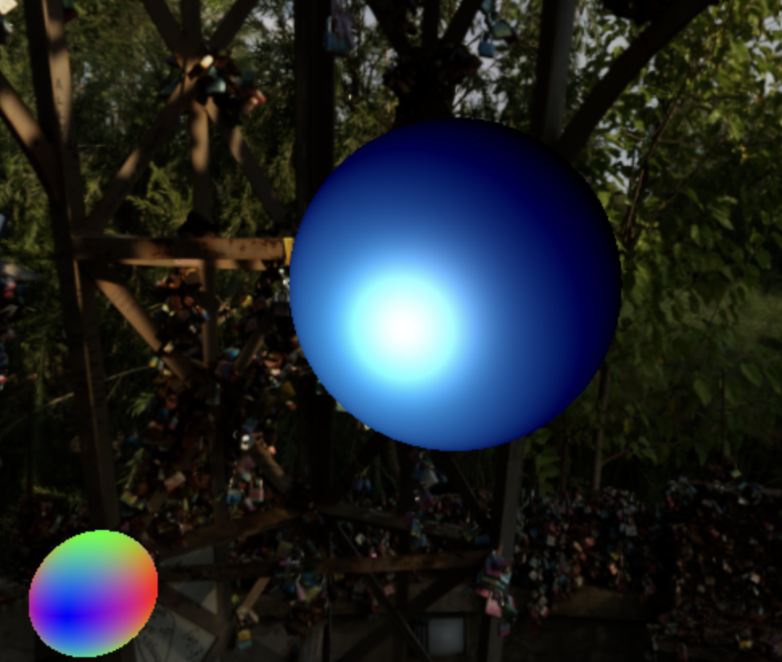
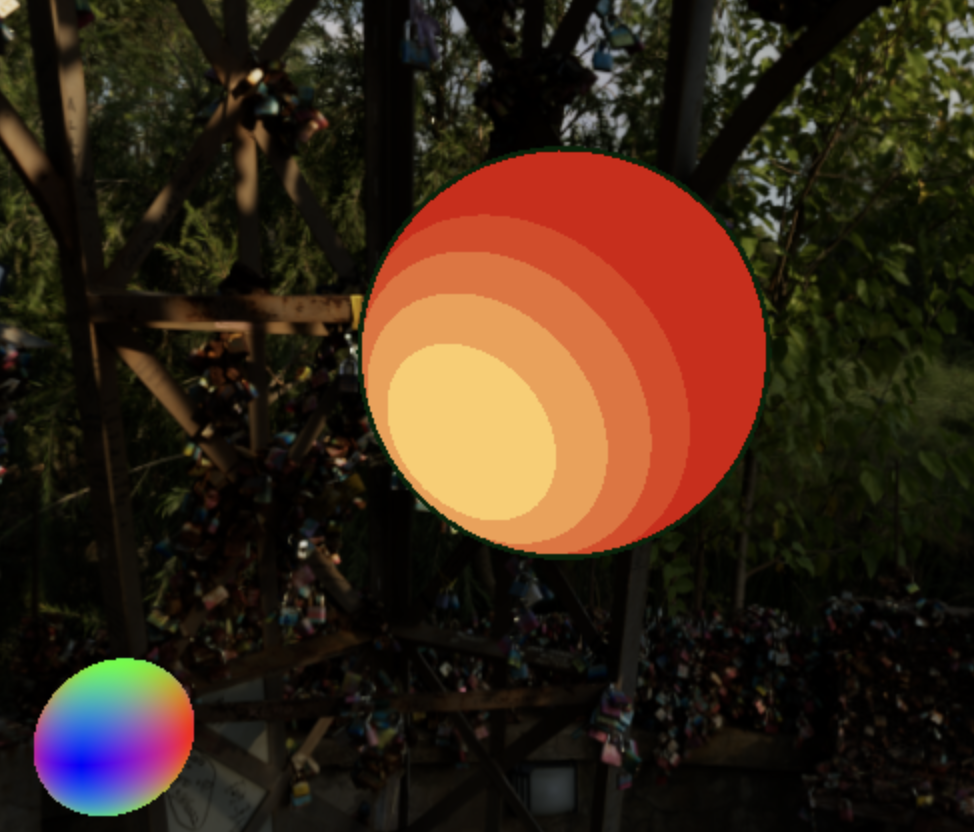
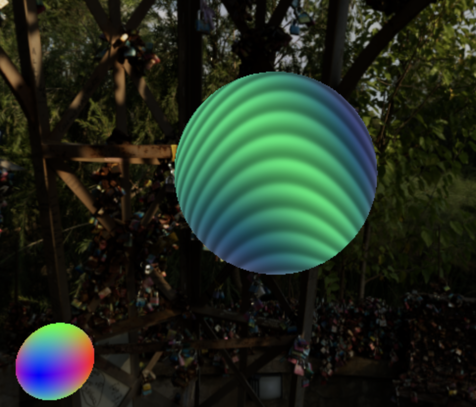

# Shaders
## Various shaders written in GLSL

### Controls
<ins>Lighting</ins>

There is a rainbow orb on the scene which acts as dynamic lighting. This orb can be controlled as follows:
<ul>
  <li>↑: forward</li>
  <li>↓: backwards</li>
  <li>→: right</li>
  <li>←: left</li>
  <li>Q: up</li>
  <li>R: down</li>
</ul>
<ins>Shaders</ins>

The light from this orb will interact with the subject of the scene, to which the shader is applied. Change the shader applied to the subject using the following keys:
<ul>
  <li>1: Phong</li>
  <li>2: Blinn-Phong</li>
  <li>3: Diamond</li>
  <li>4: Noise</li>
  <li>5: Polka-Dots</li>
  <li>6: Toon</li>
  <li>7: Toon-Glass</li>
  <li>8: Static</li>
</ul>
<ins>Geometry</ins>

The default geometry of the subject is a ball. This can be changed as following:
<ul>
  <li>shift + A: Armadillo</li>
  <li>shift + B: Ball</li>
</ul>
<ins>Scene</ins>

To view how the shaders might look in different environments, we can change the background environment using the following:
<ul>
  <li>shift + 1: Paris Benches</li>
  <li>shift + 2: Starry Night</li>
  <li>shift + 3: Open Sky</li>
</ul>
<ins>HDR Image Options</ins> 

GUI in the top right corner enables options to change renderer tone mapping, as well as lighting exposure from the background.

### Demo

  

    
    
Blinn-Phong

  

  

    
    
Toon

  

  

    
    
Noise

  

